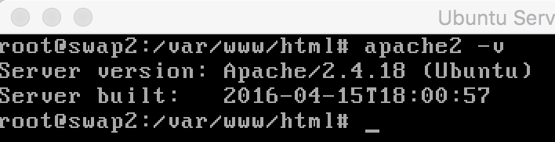
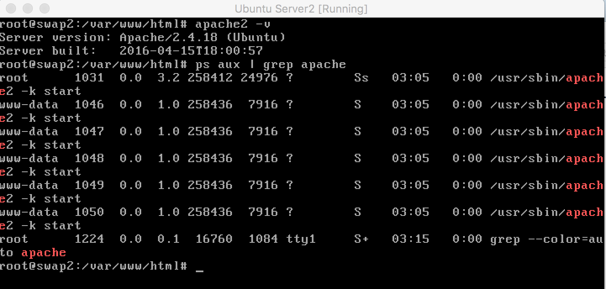
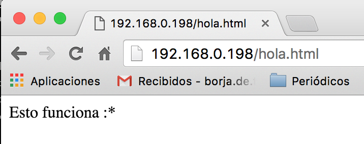

### Práctica 1.  Preparación de las herramientas
Juan Borja Álvarez Peralta
## Instalación de Máquinas Virtuales.

#1. Descargamos el software de virtualización VirtualBox desde:
[web VirtualBox] (https://www.virtualbox.org/wiki/Downloads)

#2. Descargamos en nuestro caso Ubuntu Server desde la web:
[web ubuntu Server] (http://www.ubuntu.com/download/server).

#3. Creamos dos máquinas virtuales en VirtualBox
Instalamos dicho Ubuntu Server instalando a la vez las utilidades de LAMP y ssh

#4.Creamos una contraseña para el usuario root para cada máquina
Con el comando: sudo passwd root

#5.Creamos el archivo "hola.html" en /var/www/html/hola.html para cada máquina
Haciendo uso del editor de texto vi lo creamos con la siguiente orden:
sudo vi /var/www/html/hola.html

### A continuación muestro capturas de pantalla con los resultados de esta práctica:

# Versión de apache con el comando apache2 -v

# Consultar procesos apache con el comando ps aux | grep apache

# Consultamos la web desde el navegador Chrome desde mi sistema anfitrión Mac Os

