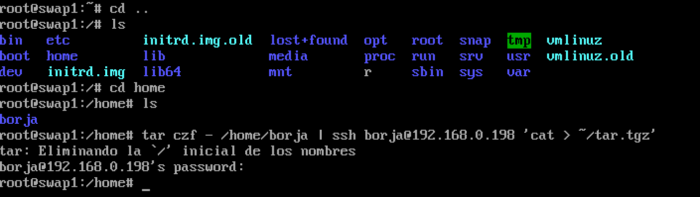
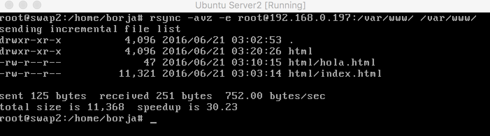
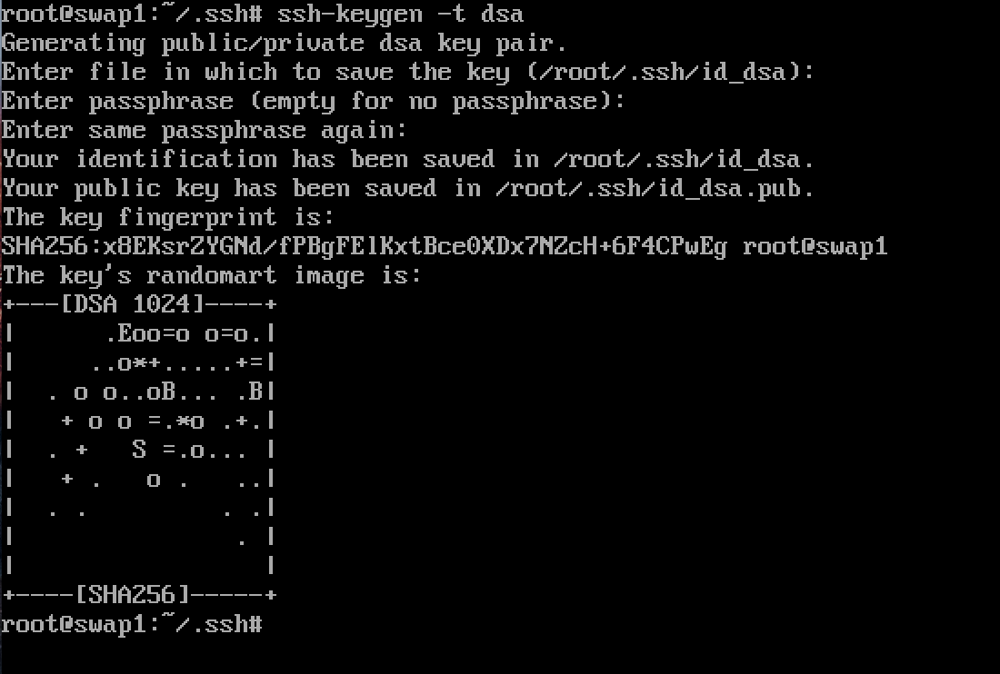
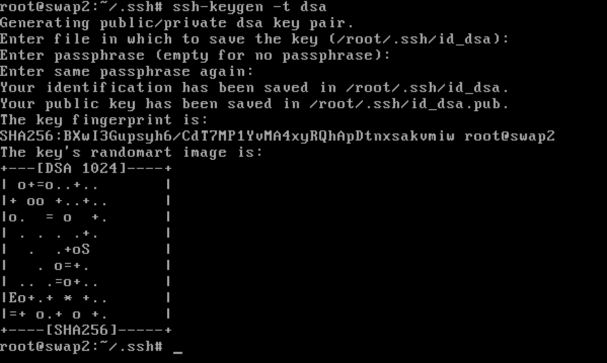
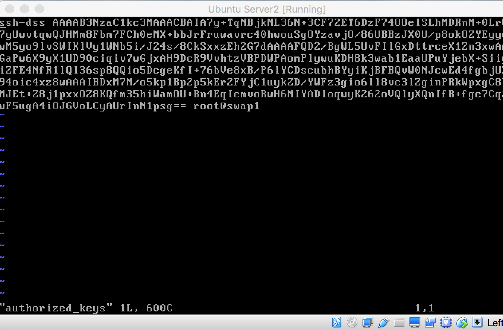
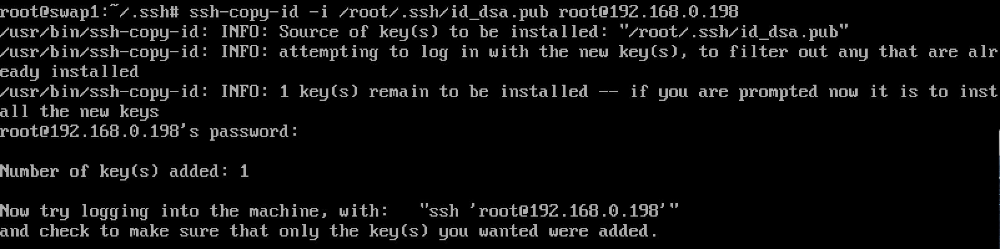
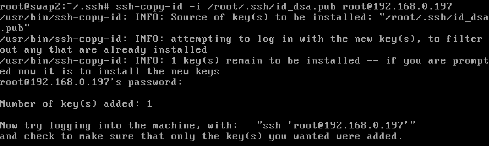
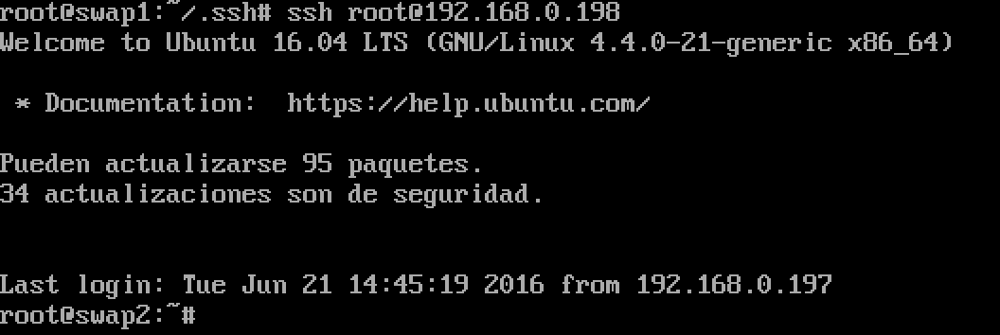
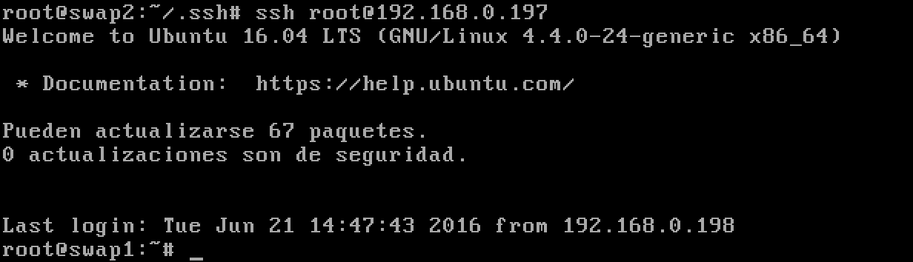
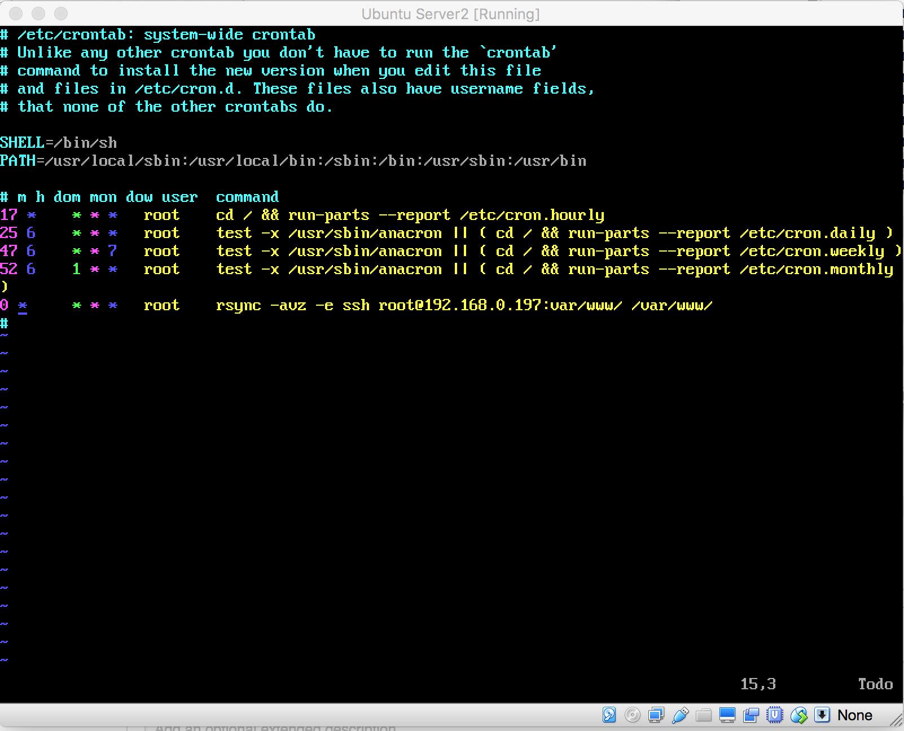

Juan Borja Álvarez Peralta
###Práctica 2:  Clonación de la información de un sitio web

El entorno de desarrollo de la práctica se va a realizar en virtualbox.
Primeramente debemos de configurar las máquinas para que en la red se vean entre sí.
Para ello configuramos la red de cada una de ellas, nos metemos en configuración, red
y en modo promiscuo le damos a permitir todo.

A continuación inicio sesión en modo root, haciendo uso del siguiente comando le asignaremos una constraseña al usuario root
"sudo passwd root"->activacion de root.
y ya podremos loguearnos con el usuario root.

##Crear un tar con ficheros locales en un equipo remoto

Copiamos el directorio "borja" en la maquina swap1comprimido en tar.gz
tar czf - home/borja | ssh borja@192.168.0.198 ‘cat >  ~/tar.tgz’  

##Herramienta rsync
Primero procedemos a instalar la herramienta rsync con el comando "sudo apt-get install rsync"
Introducimos en la máquina 2 (swap2) el siguiente comando para poder copiar los archivos del directorio /var/www/ de una maquina virtual a otra (swap1):
rsync -avz -e root@192.168.0.197:/var/www/ /var/www/

##Acceso sin contraseña para ssh
Mediante ssh-keygen podemos generar la clave, con la opción -t para el tipo de clave.
Para ello usamos el siguiente comando en ambas máquinas.

ssh-keygen -t dsa

Observamos como la clave ha sido creada:

A continuación copiamos las claves en cada máquina para poder acceder sin introducir la constraseña con el siguiente comando:
ssh-copy-id -i /root/.ssh/id_dsa.pub root@192.168.0.xxx

observamos como ahora podemos acceder sin contrañseña

##crontab
Agregamos en el archivo crontab de swap2 una tarea para que se sincronice con swap1 para ello abrimos el archivo con el siguiente comando
vi /etc/crontab
y agregamos la siguiente linea al final del archivo

0 * * * *  root rsync -avz -e ssh root@swap1:/var/www/ /var/www/

