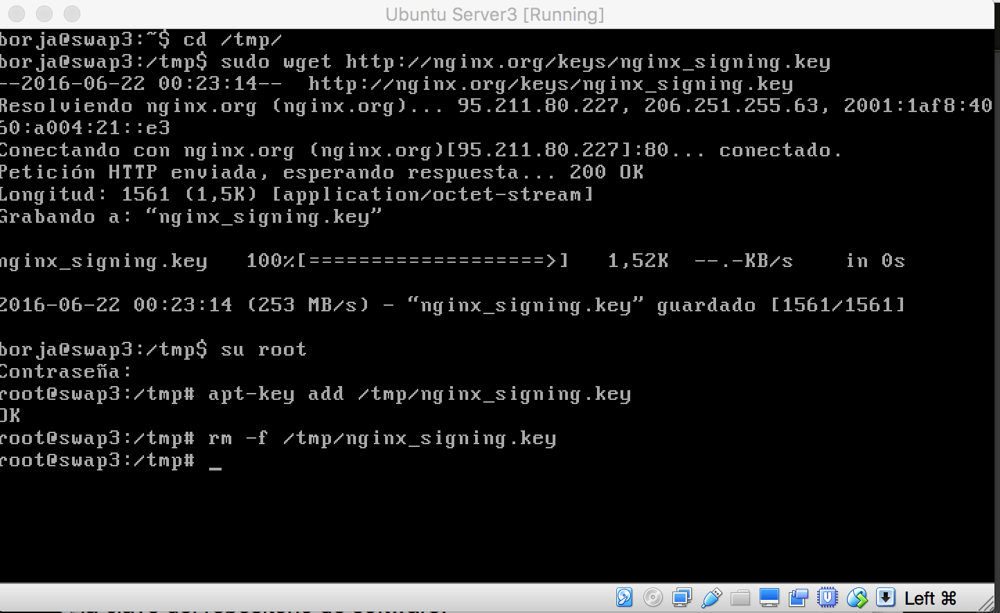
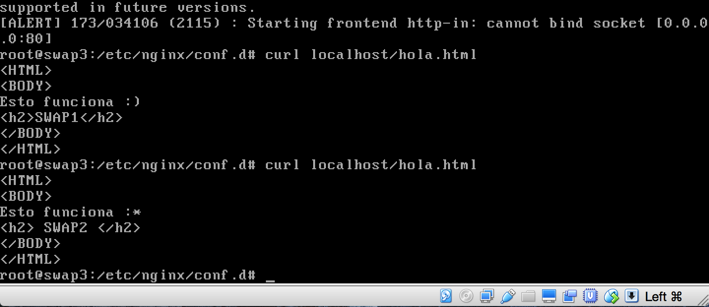

###Practica 3: Balanceo de carga
Juan Borja Álvarez Peralta

He creado una nueva máquina swap3 con la misma configuración que las otras, pero sin apache

A continuación Procedemos a instalar NGINX en ubuntu server, primero debemos de añadir el repositorio al directorio /tmp/

Continuamos editando el fichero sources.list del directorio /apt en /etc.

Una vez instalado con el comando en el terminal "apt-get install nginx" procedemos a configurar 
el archivo "default.conf" dentro del directorio nginx.

Reiniciamos el servicio con "service nginx restart"

###3. Comprobamos que al acceder desde nuestra máquina anfitriona usando el navegador chrome y me va mostrando alternativamente, haciendo uso del archivo hola.html que creamos en la práctica 1 y añadiendo los nombres swap1 y swap2 para poder distinguirla.

procedemos a realizar la misma comprobación desde la propia máquina swap3 que hemos creado para el balanceador haciendo uso del comando:

curl localhost/hola.html
curl localhost/hola.html

vemos como primero carga el archivo hola.html de una máquina
y luego el de la otra.

##Balanceo de carga con haproxy.

Procedemos a instalar ha proxy con el siguiente comando: "sudo apt-get install haproxy"
pero antes paramos nginx con "service nginx stop".
Una vez instalado configuramos el archivo de haproxy y lo dejamos igual que en el guión.

Utilizamos el comando para reiniciar el servicio
sudo /usr/sbin/haproxy -f /etc/haproxy/haproxy.cfg

Vemos a continuacion que los header del index devuelve apache

Volvamos a probar el balanceador con el comando:

curl localhost/hola.html

