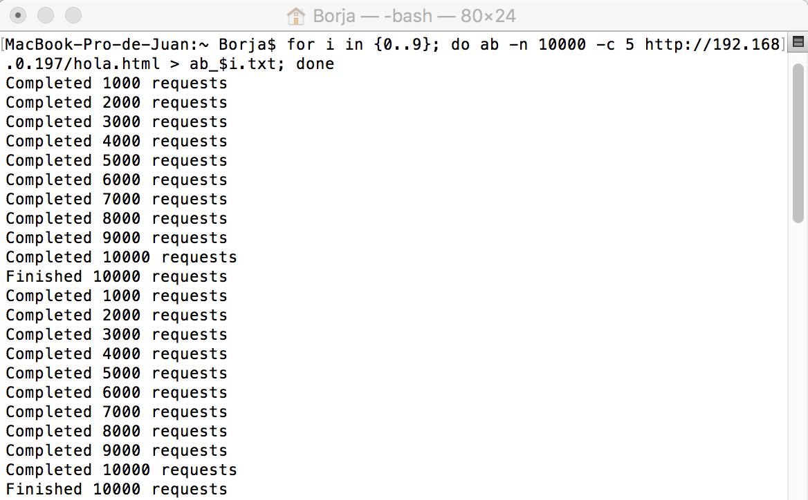
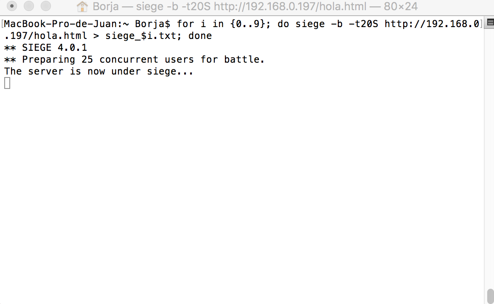
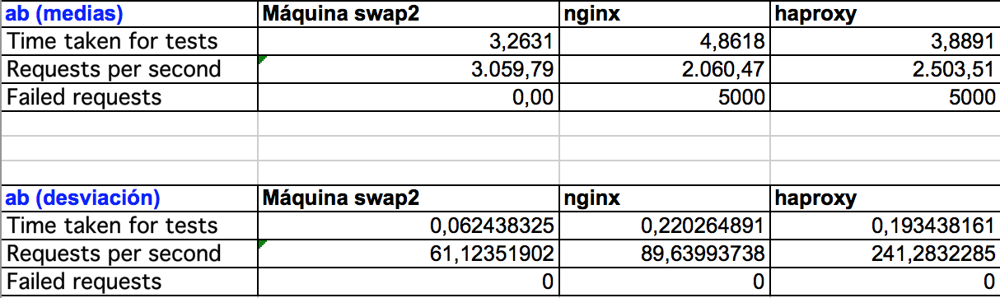
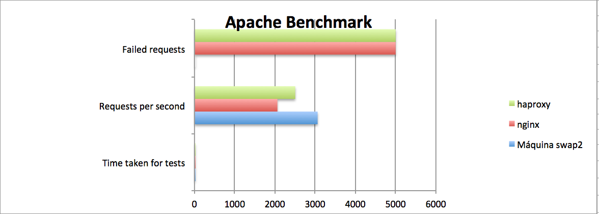
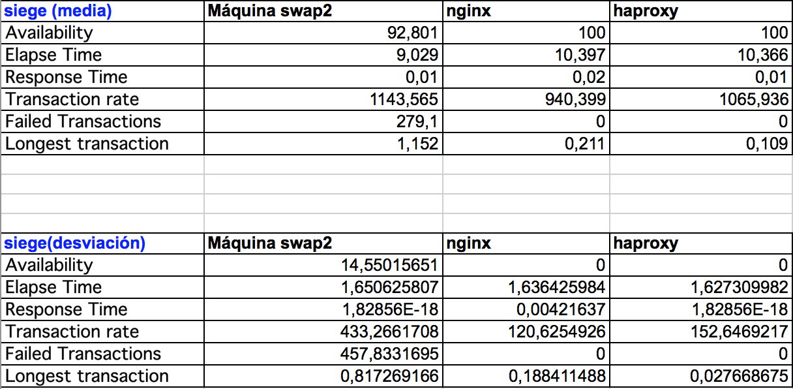
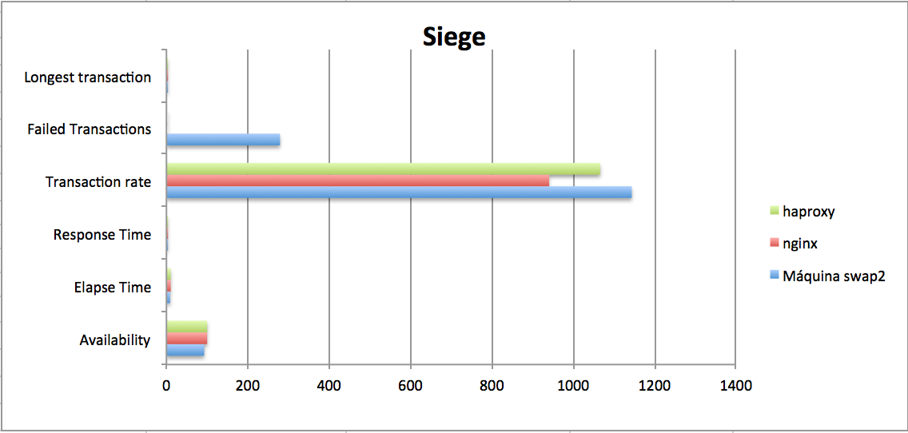

#Practica 4: Comprobar el rendimiento de servidores web

##Introducción:

Comprobaremos el rendimiento de nuestros servidores y del balanceador mediante la herramientas ab que viene incluida en MacOSX, y mediante siege.
Para poder utilizar siege lo he instalado de la siguiente forma a través del terminal:

Lo descargamos:

curl -C - -O http://download.joedog.org/siege/siege-latest.tar.gz

Lo descomprimimos:

tar -xvf siege-latest.tar.gz

Nos colocamos en el directorio y lo instalamos

./configure
make
make install

##Tomando Medidas

Para tomar las 10 medidas tanto en siege como en ab me he servido de un for en bash:

for i in {0..9}; do ab -n 10000 -c 5 http://192.168.0.197/hola.html > ab_$i.txt; done

for i in {0..9}; do siege -b -t20S http://192.168.0.197/hola.html > siege_$i.txt; done

Los datos obtenidos los podemos encontrar ! [aquí](https://github.com/0rf3o/SWAP15-16/tree/master/Practica%204/datos)

#Resultados

Los Resultados obtenidos los podemos observar en las siguientes imágenes:

#Para ab

#Para siege

