#Práctica 5: Replicación de bases de datos MySQL
Juan Borja Álvarez Peralta

##Crear una BD e insertar datos.
A continuación como se muestra en la imagen accedemos a mysql y creamos una base
de datos llamada contactos y una fila llamada datos y la mostramos.
Todos los comandos están mostrados en las capturas de pantalla.

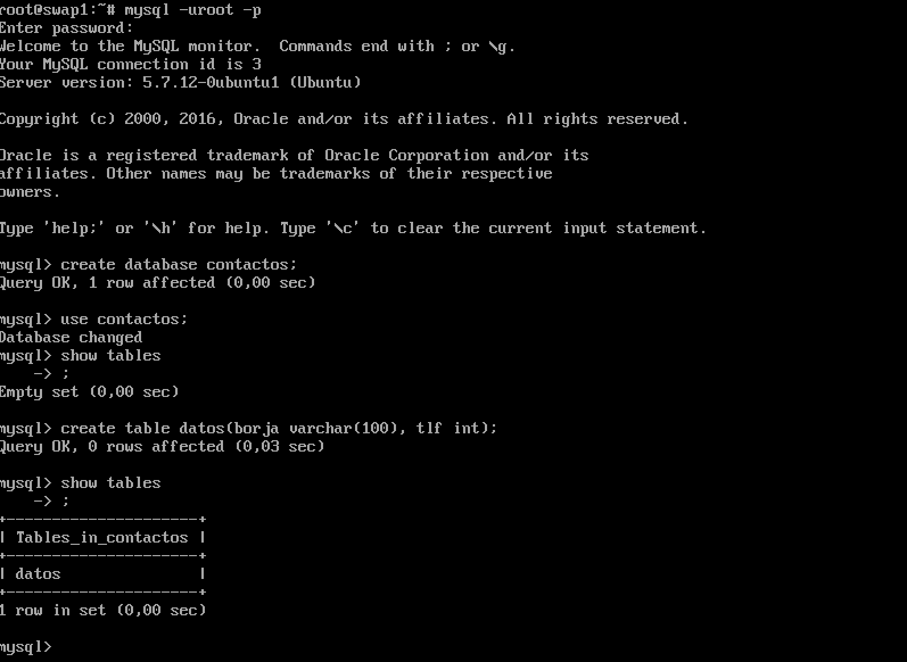

Procedemos a introducir datos y visualizar los datos.
Ya tenemos datos (un registro) insertados en nuestra BD llamada “datos”. Podemos
haber insertado más registros. Veamos cómo entrar y hacer una consulta:

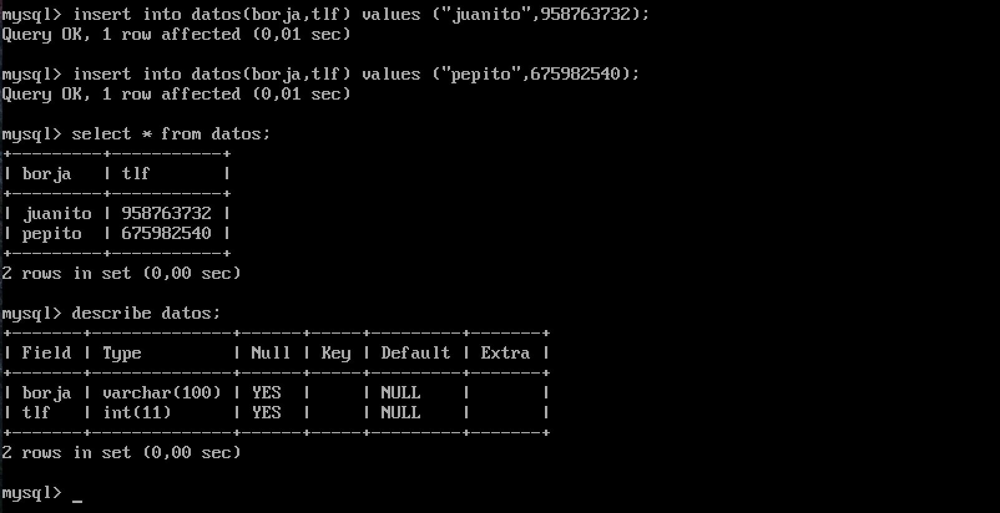

##Replicar una BD MySQL con mysqldump.

Tenemos que tener en cuenta que los datos pueden
estar actualizándose constantemente en el servidor de BD principal. En este caso,
antes de hacer la copia de seguridad en el archivo .SQL debemos evitar que se
acceda a la BD para cambiar nada.

Asi que escribimos FLUSH TABLES WITH READ LOCK;
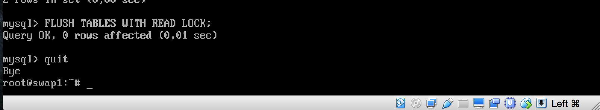

Una vez bloqueada la escritura en la db, volcamos la copia con el siguiente comando:

mysqldump contactos -u root -p > /root/contactos.sql

Una vez hecho procedemos a desbloquear la db como podemos observar en la siguiente captura.
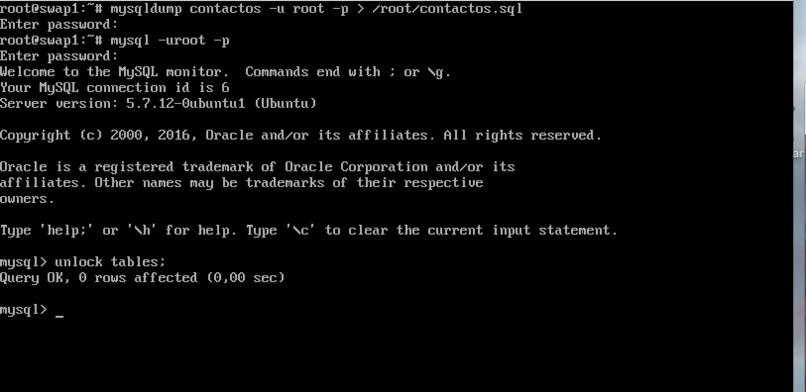

A continuación desde la otra maquina virtual vamos a proceder a copiar los datos.

Con el archivo de copia de seguridad en el esclavo ya podemos importar la BD
completa en el MySQL. Para ello, en un primer paso creamos la BD:

# mysql -uroot -p
mysql> create database contactos;
mysql> quit

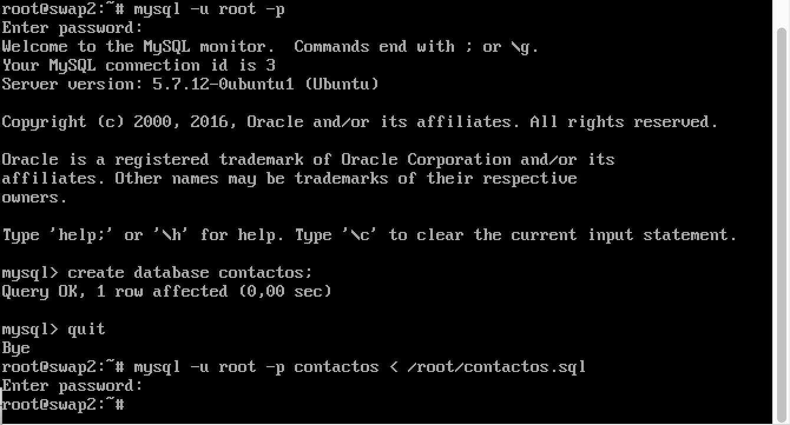

##Replicación de BD mediante una configuración maestro-esclavo:

Lo primero que debemos hacer es la configuración de mysql del maestro. Para ello
editamos, como root,  /etc/mysql/mysql.conf  el archivo mysqld.cnf 
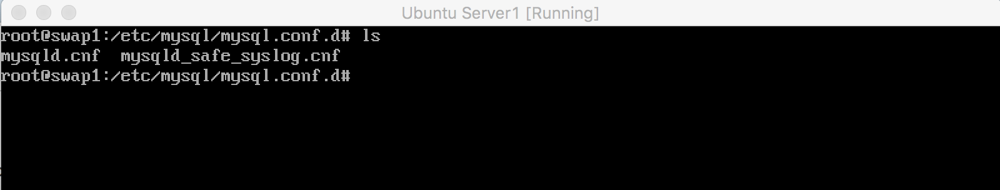
y modificamos los siguientes parámetros:
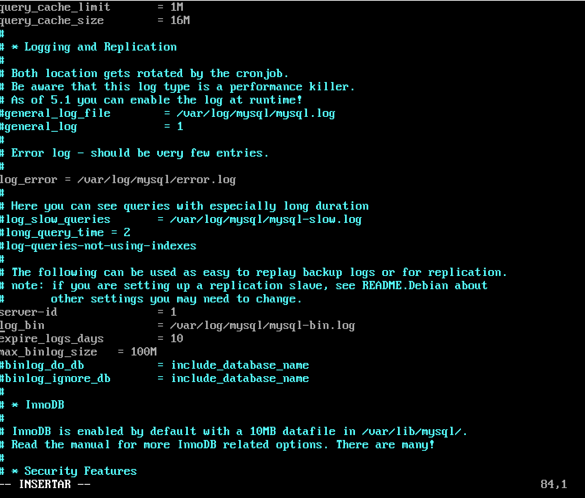

Comentamos el parámetro bind-address que sirve para que escuche a un servidor:
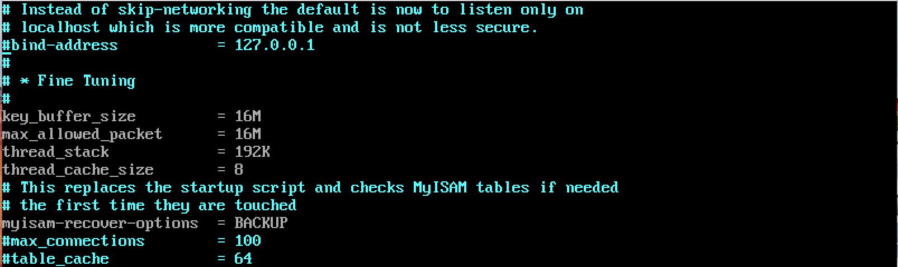
Le indicamos el archivo donde almacenar el log de errores. Por ejemplo al reiniciar el
servicio, si cometemos algún error en el archivo de configuración en el archivo de log
nos mostrará con detalle lo sucedido.

Después de esto reiniciamos el servicio con: "/etc/init.d/mysql restart"
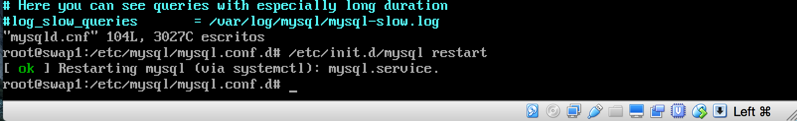

Y procedemos a configurar la máquina 2, igual que en la anterior salvo por el server-id=2:
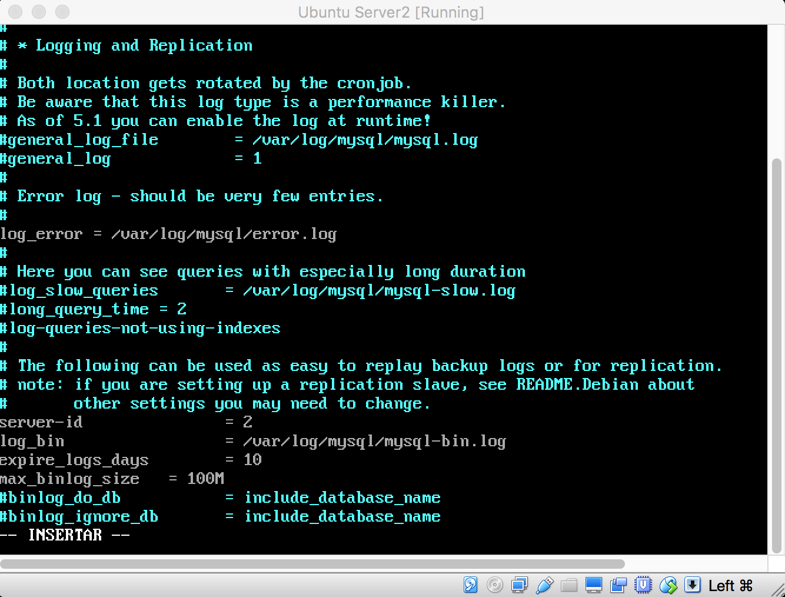
Procedemos a reiniciar el servicio: "/etc/init.d/mysql restart"
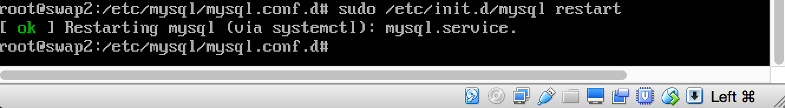

Ahora volvemos a nuestra máquina 1 (swap1) que va a ser configurada como nuestro maestro para garantizar el acceso al esclava:

mysql> CREATE USER esclavo IDENTIFIED BY 'esclavo';
GRANT REPLICATION SLAVE ON *.* TO 'esclavo'@'%' IDENTIFIED BY 'esclavo';
FLUSH PRIVILEGES;
FLUSH TABLES;
FLUSH TABLES WITH READ LOCK;

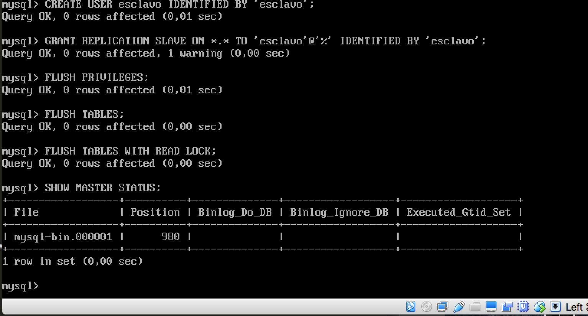

Volvemos a la máquina esclava (swap2), entramos en mysql y le damos los datos del maestro.
CHANGE MASTER TO MASTER_HOST='192.168.1.139', MASTER_USER='esclavo', MASTER_PASSWORD='esclavo', MASTER_LOG_FILE='mysql-bin.000001', MASTER_LOG_POS=980, MASTER_PORT=3306;
START SLAVE;

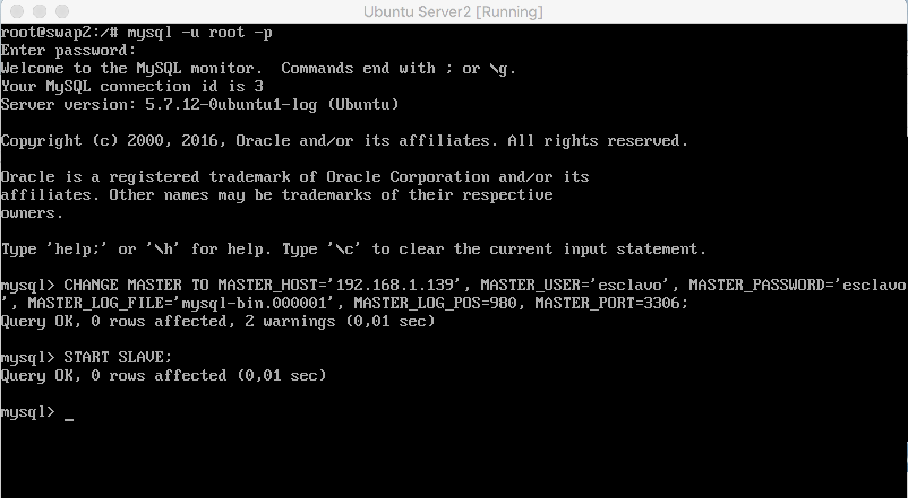

Comprobamos que todo ha ido bien en el esclavo con: "“SHOW SLAVE STATUS\G”"

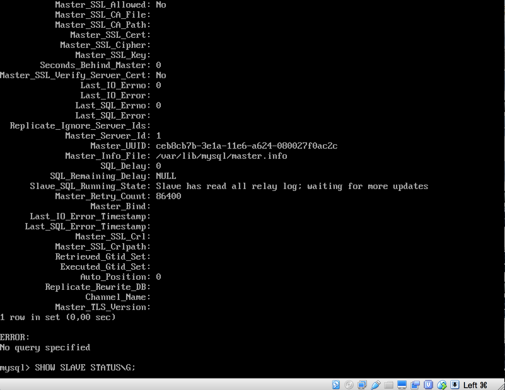

a continuación mostramos que todo funciona correctamente insertando algunos datos y comprobando que se actualiza,en la siguiente imagen podemos comprobarlo.
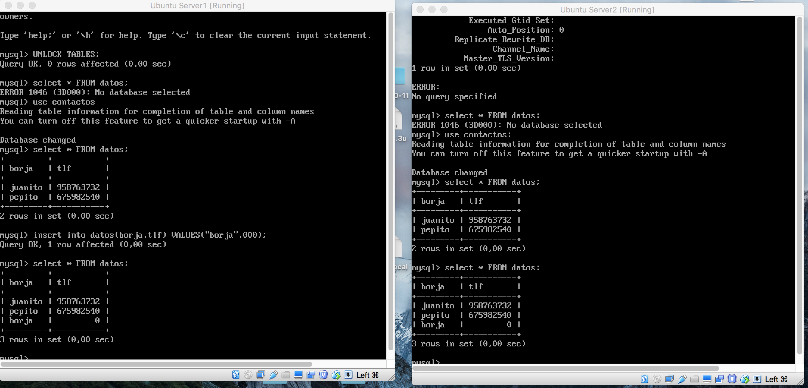

##Replicación de BD mediante una configuración maestro-maestro:

Solo tenemos que configurar otro maestro-esclavo pero invirtiendo las máquinas ahora *swap1* será esclavo y *swap2* maestro, es decir:

Crear el usuario en *swap2* que antes era esclavo.

CREATE USER esclavo IDENTIFIED BY 'esclavo';
GRANT REPLICATION SLAVE ON *.* TO 'esclavo'@'%' IDENTIFIED BY 'esclavo';
FLUSH PRIVILEGES;
FLUSH TABLES;
FLUSH TABLES WITH READ LOCK;

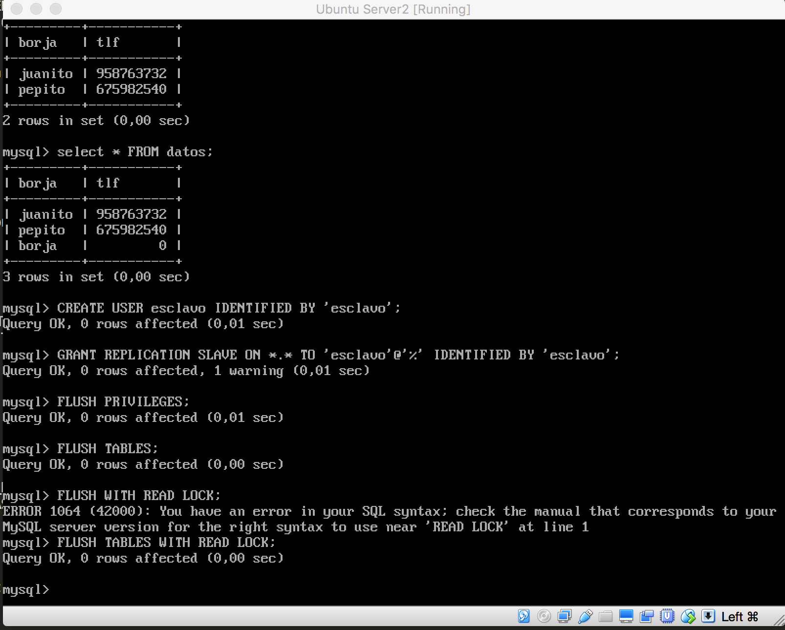

Crear el esclavo en *swap1* que antes era maestro.

CHANGE MASTER TO MASTER_HOST='192.168.1.138', MASTER_USER='esclavo', MASTER_PASSWORD='esclavo', MASTER_LOG_FILE='mysql-bin.000001', MASTER_LOG_POS=980, MASTER_PORT=3306;
START SLAVE;

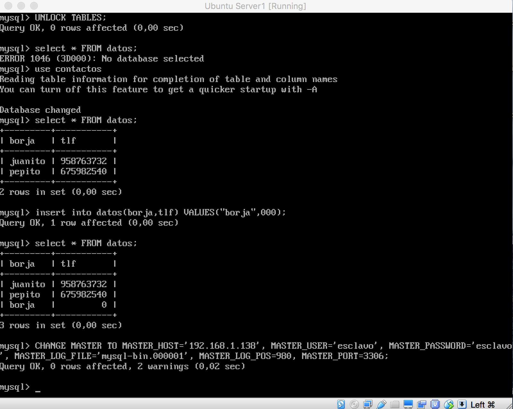

A continuación muestro pruebas de inserciones y borrados de datos en ambas máquinas y vemos como se actualiza en ambas:

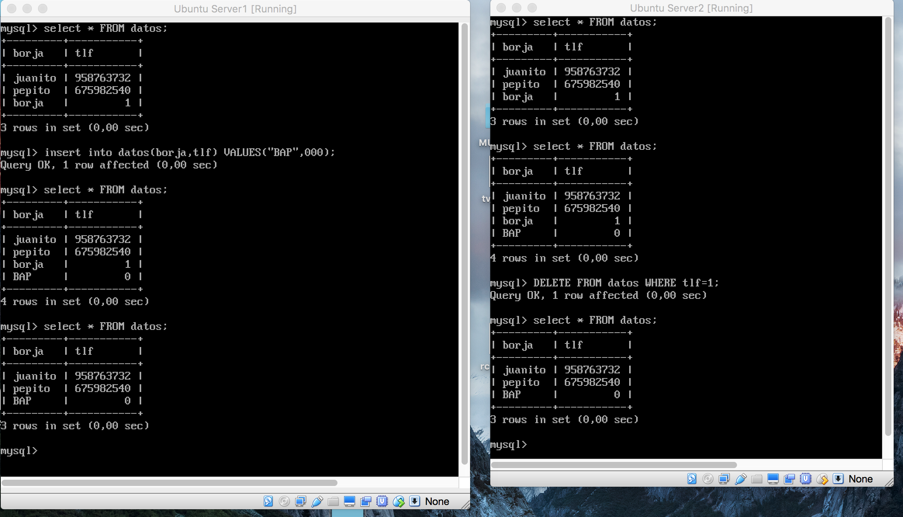
