#Práctica 6: Discos en RAID
Juan Borja Álvarez Peralta

##Configuración del RAID por software:

He creado una nueva máquina virtual swap6  a la
que, estando apagada, añadiremos dos discos del mismo tipo y capacidad.

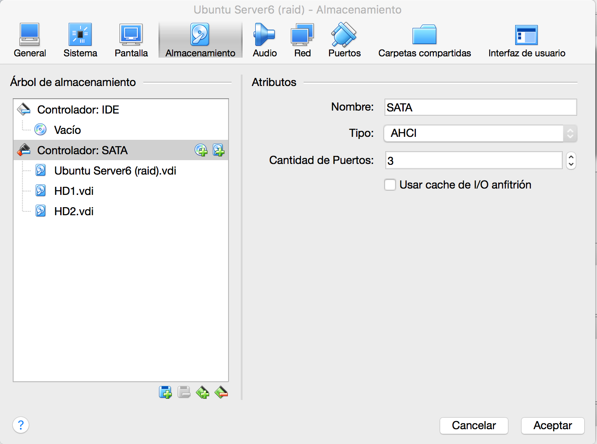
Procedemos a instalar el programa con "sudo apt-get install mdadm"

Debemos buscar la información (identificación asignada por Linux) de ambos discos, "sudo fdisk -l"

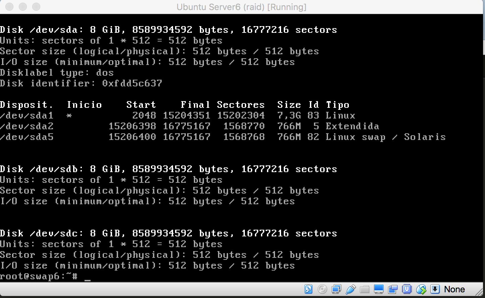

Ahora ya podemos crear el RAID 1, usando el dispositivo /dev/md0, indicando el número de dispositivos a utilizar (2), 
así como su ubicación. "sudo mdadm -C /dev/md0 --level=raid1 --raid-devices=2 /dev/sdb /dev/sdc"

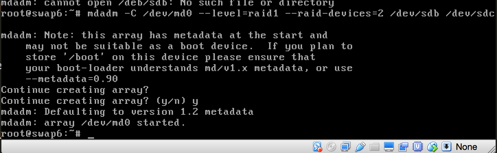
Una vez creado el dispositivo RAID, le damos formato con "sudo mkfs.ext4 /dev/md0"

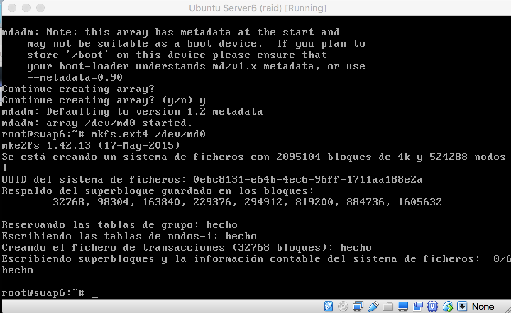
Ahora ya podemos crear el directorio en el que se montará la unidad del RAID con:
"mkdir /datos"
"mount /dev/md0 /datos"

Para comprobar el estado del RAID, ejecutaremos "sudo mdadm --detail /dev/md0"

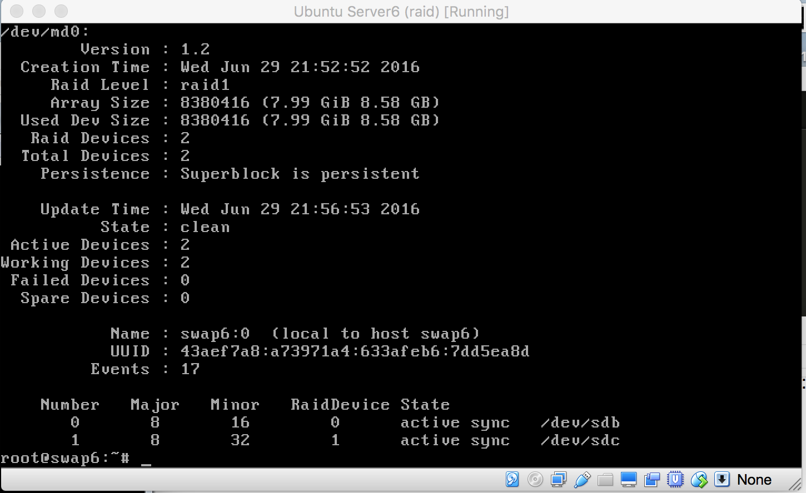

Obtenemos el UUID del disco con el siguiente comando:

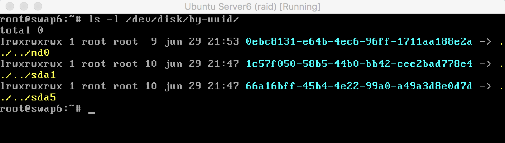

en nuestro caso es md0 y Agregamos esta línea al fichero **/etc/fstab**

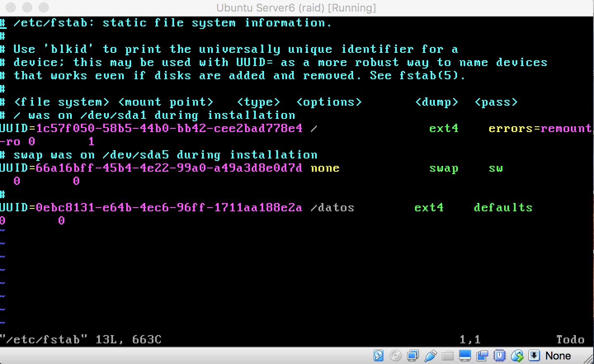

Después de realizar estos pasos reinicié la máquina para comprobar que todo estaba correcto,y me di cuenta
que cambió el nombre de md0 a md127.

Para comprobar que todo funciona vamos a simular fallos en los discos.

Simulamos un fallo y comprobamos el estado del RAID con el siguiente comando

sudo mdadm --manage --set-faulty /dev/md7 /dev/sdb

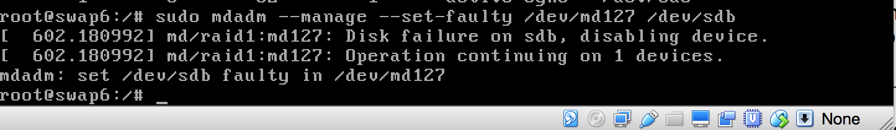

Comprobamos que aunque el disco falle podemos seguir accediendo a los datos

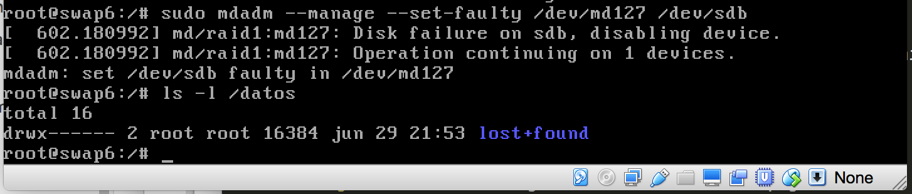

Quitamos el disco con el comando

sudo mdadm --manage --remove /dev/md127 /dev/sdb
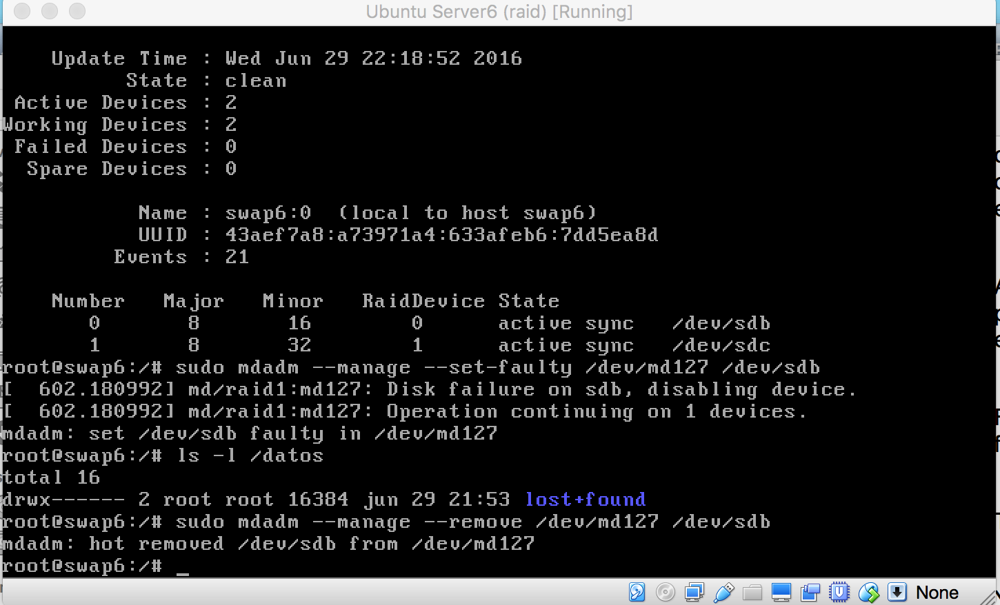
 y comprobamos que podemos seguir trabajando con los datos 
 
 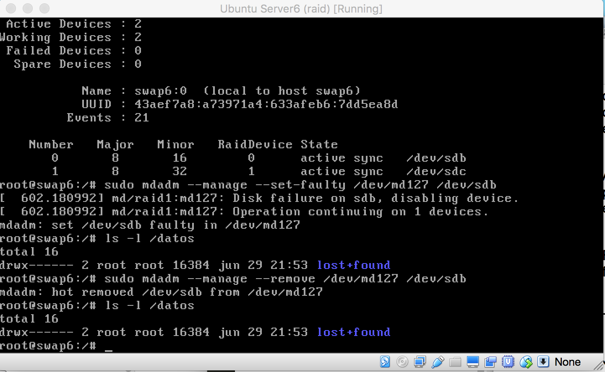
Agregamos un  nuevo disco 

sudo mdadm --manage --add /dev/md127 /dev/sdb

 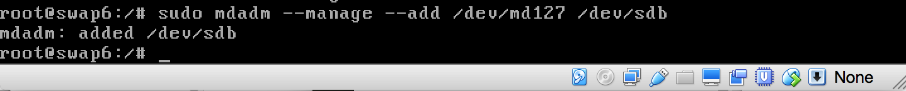
 
 Comprobamos como se va reconstruyendo el disco:
 
 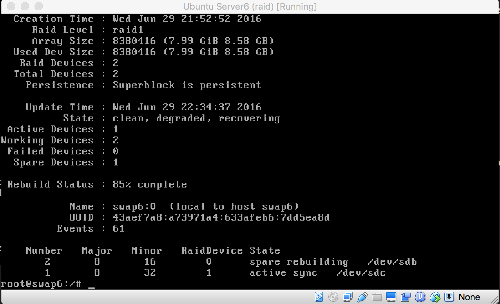

